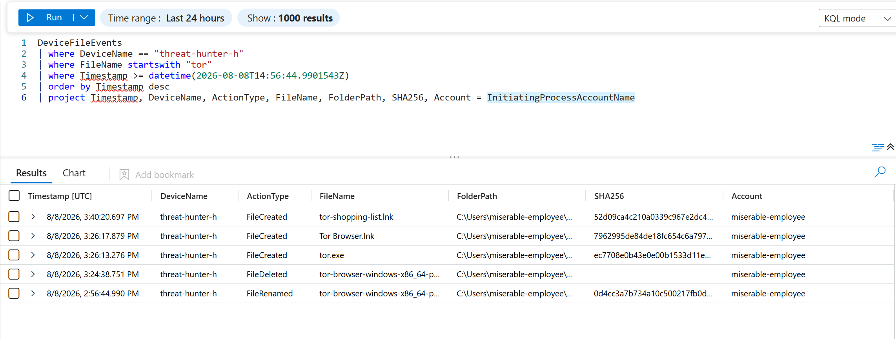
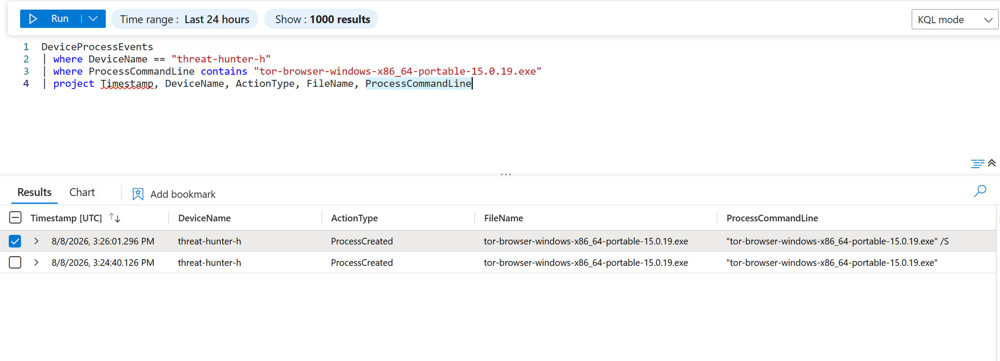
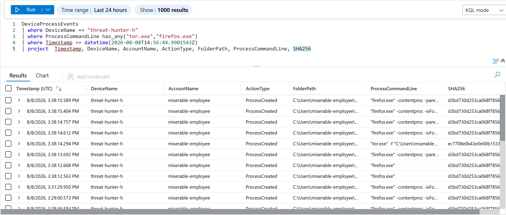
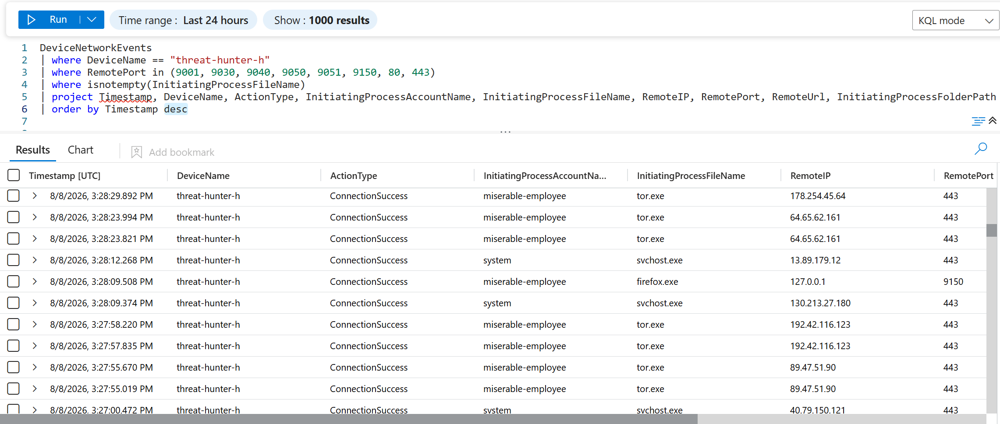

# Threat Hunt Report: Unauthorized TOR Usage
- [Scenario Creation](https://github.com/huzaifah-cyber/threat-hunt-tor-scenario/blob/main/Creating%20the%20Threat%20Hunt%20Scenario.md)

## Platforms and Languages Leveraged
- Windows 11 Virtual Machines (Microsoft Azure)
- EDR Platform: Microsoft Defender for Endpoint
- Kusto Query Language (KQL)
- Tor Browser

## Scenario

Management suspects that some employees may be using TOR browsers to bypass network security controls because recent network logs show unusual encrypted traffic patterns and connections to known TOR entry nodes. Additionally, there have been anonymous reports of employees discussing ways to access restricted sites during work hours. The goal is to detect any TOR usage and analyze related security incidents to mitigate potential risks. If any use of TOR is found, notify management.

### High-Level TOR-Related IoC Discovery Plan

- **Check `DeviceFileEvents`** for any `tor(.exe)` or `firefox(.exe)` file events.
- **Check `DeviceProcessEvents`** for any signs of installation or usage.
- **Check `DeviceNetworkEvents`** for any signs of outgoing connections over known TOR ports.

---

## Steps Taken

### 1. Searched the `DeviceFileEvents` Table

Searched for any file that had the string "tor" in it and discovered what looks like the user "miserable-employee" downloaded a TOR installer, did something that resulted in the installer being renamed and later deleted, and TOR-related files (`tor.exe`, `Tor Browser.lnk`) being created on the desktop, followed by the creation of a shortcut called `tor-shopping-list.txt` on the desktop at `2026-08-08T15:40:20.697Z`. These events began at `2026-08-08T14:56:44.9901543Z`.

**Query used to locate events:**

```kql
DeviceFileEvents
| where DeviceName == "threat-hunter-h"
| where FileName startswith "tor"
| where Timestamp >= datetime(2026-08-08T14:56:44.9901543Z)
| order by Timestamp desc 
| project Timestamp, DeviceName, ActionType, FileName, FolderPath, SHA256, Account = InitiatingProcessAccountName
```


---

### 2. Searched the `DeviceProcessEvents` Table

Searched for any `ProcessCommandLine` that contained the string "tor-browser-windows-x86_64-portable-15.0.19.exe". Based on the logs returned, the employee on the "threat-hunter-h" device first ran the file at `2026-08-08T15:24:40.126Z`, then executed it again at `2026-08-08T15:26:01.296Z` with the `/S` switch, triggering a silent installation.

**Query used to locate event:**

```kql
DeviceProcessEvents
| where DeviceName == "threat-hunter-h"
| where ProcessCommandLine contains "tor-browser-windows-x86_64-portable-15.0.19.exe"
| project Timestamp, DeviceName, ActionType, FileName, ProcessCommandLine
```


---

### 3. Searched the `DeviceProcessEvents` Table for TOR Browser Execution

Searched for any indication that the user **miserable-employee** actually opened the TOR browser. There was evidence of `tor.exe` and repeated `firefox.exe` process creations shortly after installation, confirming the browser was launched and used.

**Query used to locate events:**

```kql
DeviceProcessEvents
| where DeviceName == "threat-hunter-h"
| where ProcessCommandLine has_any("tor.exe","firefox.exe")
| where Timestamp >= datetime(2026-08-08T14:56:44.9901543Z)
| project Timestamp, DeviceName, AccountName, ActionType, FolderPath, ProcessCommandLine, SHA256
```


---

### 4. Searched the `DeviceNetworkEvents` Table for TOR Network Connections

Searched for any indication the TOR browser was used to establish a connection using any of the known TOR ports. Starting at `2026-08-08T15:27:55.019Z`, the employee on the "threat-hunter-h" device established multiple connections via `tor.exe` to remote IP addresses (including `89.47.51.90`, `192.42.116.123`, `64.65.62.161`, and `178.254.45.64`) on port `443`, along with a local loopback connection from `firefox.exe` to `127.0.0.1` on port `9150` — the default Tor Browser SOCKS proxy port.

**Query used to locate events:**

```kql
DeviceNetworkEvents
| where DeviceName == "threat-hunter-h"
| where RemotePort in (9001, 9030, 9040, 9050, 9051, 9150, 80, 443)
| where isnotempty(InitiatingProcessFileName)
| project Timestamp, DeviceName, ActionType, InitiatingProcessAccountName, InitiatingProcessFileName, RemoteIP, RemotePort, RemoteUrl, InitiatingProcessFolderPath
| order by Timestamp desc
```


---

## Chronological Event Timeline

### 1. File Rename - TOR Installer

- **Timestamp:** `2026-08-08T14:56:44.9901543Z`
- **Event:** The user "miserable-employee" downloaded and renamed a file to `tor-browser-windows-x86_64-portable-15.0.19.exe`.
- **Action:** File renamed.
- **File Path:** `C:\Users\miserable-employee\Downloads\tor-browser-windows-x86_64-portable-15.0.19.exe`

### 2. Process Execution - TOR Browser Installation

- **Timestamp:** `2026-08-08T15:24:40.126Z`
- **Event:** The user "miserable-employee" first executed `tor-browser-windows-x86_64-portable-15.0.19.exe`.
- **Action:** Process creation detected.
- **Command:** `tor-browser-windows-x86_64-portable-15.0.19.exe`
- **File Path:** `C:\Users\miserable-employee\Downloads\tor-browser-windows-x86_64-portable-15.0.19.exe`

### 3. File Deletion - Installer Cleanup

- **Timestamp:** `2026-08-08T15:24:38.751Z`
- **Event:** The original installer file was deleted, consistent with the self-extracting installer completing extraction.
- **Action:** File deletion detected.

### 4. Process Execution - Silent Installation

- **Timestamp:** `2026-08-08T15:26:01.296Z`
- **Event:** The user "miserable-employee" ran the installer again, this time using the `/S` (silent) switch, initiating a background installation of the TOR Browser.
- **Action:** Process creation detected.
- **Command:** `tor-browser-windows-x86_64-portable-15.0.19.exe /S`

### 5. File Creation - TOR Executable and Shortcut

- **Timestamps:**
  - `2026-08-08T15:26:13.276Z` - `tor.exe` created.
  - `2026-08-08T15:26:17.879Z` - `Tor Browser.lnk` created.
- **Event:** Installation completed, dropping the TOR executable and a desktop shortcut.
- **Action:** File creation detected.

### 6. Network Connection - TOR Network

- **Timestamp:** `2026-08-08T15:27:55.019Z`
- **Event:** A network connection to IP `89.47.51.90` on port `443` by user "miserable-employee" was established using `tor.exe`, confirming TOR browser network activity.
- **Action:** Connection success.
- **Process:** `tor.exe`

### 7. Additional Network Connections - TOR Browser Activity

- **Timestamps:**
  - `2026-08-08T15:27:57.835Z` / `15:27:58.220Z` - Connected to `192.42.116.123` on port `443`.
  - `2026-08-08T15:28:09.508Z` - Local loopback connection from `firefox.exe` to `127.0.0.1` on port `9150`.
  - `2026-08-08T15:28:23.821Z` / `15:28:23.994Z` - Connected to `64.65.62.161` on port `443`.
  - `2026-08-08T15:28:29.892Z` - Connected to `178.254.45.64` on port `443`.
- **Event:** Additional TOR network connections were established, indicating ongoing activity by user "miserable-employee" through the TOR browser.
- **Action:** Multiple successful connections detected.

### 8. File Creation - TOR Shopping List

- **Timestamp:** `2026-08-08T15:40:20.697Z`
- **Event:** The user "miserable-employee" created a shortcut named `tor-shopping-list.lnk` on the desktop, potentially indicating a list or notes related to their TOR browser activities.
- **Action:** File creation and deletion detected.
- **File Path:** `C:\Users\miserable-employee\Desktop\tor-shopping-list.lnk`
- **File Path:** `C:\Users\miserable-employee\Desktop\tor-shopping-list.txt`

---

## Summary

The user "miserable-employee" on the "threat-hunter-h" device downloaded and silently installed the TOR browser. They proceeded to launch the browser, establish multiple connections within the TOR network, and created files related to TOR on their desktop, including a shortcut named `tor-shopping-list.lnk`. This sequence of activities indicates that the user actively installed, configured, and used the TOR browser, likely for anonymous browsing purposes, with possible documentation in the form of the "shopping list" file.

---

## Response Taken

TOR usage was confirmed on the endpoint `threat-hunter-h` by the user `miserable-employee`. The device was isolated, and the user's direct manager was notified.

---
